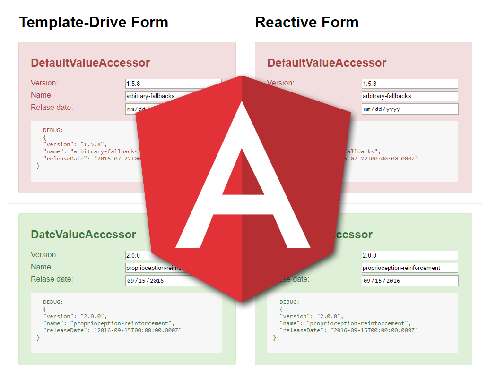

# Angular 2: How to use date input controls with Angular Forms

[](http://johanneshoppe.github.io/angular-date-value-accessor/)

## The problem

Working with forms is pretty easy in Angular 2.
You just need to decide between Template-Driven and Reactive Forms and you are ready to start with some bindings and validation. The following code shows a two-way data binding with `ngModel` against a property of type `string`:

```
<input type="text" name="name" [(ngModel)]="myName">
```

But there is one problem to tackle: models of type `Date`!  
You might wonder, because HTML5 date input controls are not working as expected:

```
<input type="date" name="releaseDate" [(ngModel)]="myBirtday">
```

Even if `myBirtday` contains a valid date, the date input control is not rendering the value at all.
In fact, we are supposed to set a string that is representing a full-date as defined in [RFC 3339](https://www.w3.org/TR/html-markup/references.html#refsRFC3339). The same string is written back to the model, when changes have been made, e.g. "2016-10-13". This behavior is specified in the [W3C HTML language reference for `inputEl.value`](https://www.w3.org/TR/html-markup/input.date.html#input.date.attrs.value). According to the specification, date input controls are based on strings. So what can we do to keep the Date type?

## A solution

Let's review the possible solutions:

1. We could create a [custom form control](http://blog.thoughtram.io/angular/2016/07/27/custom-form-controls-in-angular-2.html). This would be a clean and extendable solution, but it might lead to more code than required for the given use-case.

2. We could convert the strings directly in our `@Component` as described [here](http://stackoverflow.com/a/37055451). But do we really want to bloat our "business code layer" with boilerplate code?

3. We could create a __custom value accessor__. The following article discusses this option.

It turns out, that date input control has another, not that well-known property: [`inputEl.valueAsDate`](https://www.w3.org/TR/2012/WD-html5-20121025/common-input-element-apis.html#dom-input-valueasdate)! The `inputEl.valueAsDate` attribute represents the value (still a string) of the element, interpreted as a date. This is exactly what we need. Now we only need to convince Angular to use this property, instead of `inputEl.value`. 

Fortunately Angular 2 is very expansible here. FormControls (both template-driven and reactive) subscribe for values and write values via Directives that implement `ControlValueAccessor`. Take a look at the relevant method [selectValueAccessor](https://github.com/angular/angular/blob/2.1.0-beta.0/modules/%40angular/forms/src/directives/shared.ts#L140), which is used in all necessary directives. Normal input controls (e.g. `<input type="text">`) or textareas are handled by the [DefaultValueAccessor](https://github.com/angular/angular/blob/2.1.0-beta.0/modules/%40angular/forms/src/directives/default_value_accessor.ts). Another example is the [CheckboxValueAccessor](https://github.com/angular/angular/blob/2.1.0-beta.0/modules/%40angular/forms/src/directives/checkbox_value_accessor.ts) which is applied to checkbox input controls.

The job isn't complicated at all. We just need to implement a new value accessor for date input controls.  
`DateValueAccessor` is a nice name:

```js
// date-value-accessor.ts

import { Directive, ElementRef, HostListener, Renderer, forwardRef } from '@angular/core';
import { ControlValueAccessor, NG_VALUE_ACCESSOR } from '@angular/forms';

export const DATE_VALUE_ACCESSOR: any = {
  provide: NG_VALUE_ACCESSOR,
  useExisting: forwardRef(() => DateValueAccessor),
  multi: true
};

/**
 * The accessor for writing a value and listening to changes on a date input element
 *
 *  ### Example
 *  `<input type="date" name="myBirthday" ngModel useValueAsDate>`
 */
@Directive({
  selector: '[useValueAsDate]',
  providers: [DATE_VALUE_ACCESSOR]
})
export class DateValueAccessor implements ControlValueAccessor {

  @HostListener('input', ['$event.target.valueAsDate']) onChange = (_: any) => { };
  @HostListener('blur', []) onTouched = () => { };

  constructor(private _renderer: Renderer, private _elementRef: ElementRef) { }

  writeValue(value: Date): void {
    this._renderer.setElementProperty(this._elementRef.nativeElement, 'valueAsDate', value);
  }

  registerOnChange(fn: (_: any) => void): void { this.onChange = fn; }
  registerOnTouched(fn: () => void): void { this.onTouched = fn; }

  setDisabledState(isDisabled: boolean): void {
    this._renderer.setElementProperty(this._elementRef.nativeElement, 'disabled', isDisabled);
  }
}

```

We attach the `DateValueAccessor` to the multi-provider `DATE_VALUE_ACCESSOR`, so that [selectValueAccessor](https://github.com/angular/angular/blob/2.1.0-beta.0/modules/%40angular/forms/src/directives/shared.ts#L140) can find it.

The only question is, which selector should be used. I decided for an opt-in solution. Here the DateValueAccessor selects on the attribute "useValueAsDate".

```html
<input type="date" name="myBirthday" ngModel useValueAsDate>

OR

<input type="date" name="myBirthday" [(ngModel)]="myBirthday" useValueAsDate>

OR

<input type="date" formControlName="myBirthday" useValueAsDate>
```

It is also possible to fix the default implementation. The following selector would activate the feature magically. 

```js
// this selector changes the previous behavior silently and might break existing code
selector: 'input[type=date][formControlName],input[type=date][formControl],input[type=date][ngModel]'
```

But please be aware, that this might break existing implementations that rely of the old behaviour. So I would go for the opt-in version!

## It's all on NPM

For your convenience, I created the project [`angular-data-value-accessor`](https://github.com/JohannesHoppe/angular-date-value-accessor) on Github.  
There is also a NPM package available:


```bash
npm install --save angular-date-value-accessor
```

Then import the module via NgModule:

```js
// app.module.ts

import { DateValueAccessorModule } from 'angular-date-value-accessor';

@NgModule({
  imports: [
    DateValueAccessorModule
  ]
})
export class AppModule { }
```

## Demo

Of course, there is a demo at:
http://johanneshoppe.github.io/angular-date-value-accessor/