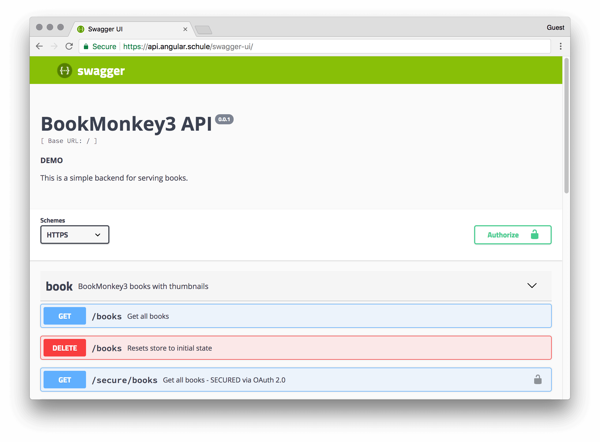

**In this article, we will take a look at swagger codegen. It will save you a ton of work and pain by generating HTTP services automatically from your swagger API description.**

<hr>

Swagger is the world’s largest framework of tools for the [OpenAPI Specification (OAS)](https://github.com/OAI/OpenAPI-Specification).
<!--
The OpenAPI Specification (OAS) defines a standard interface description for REST APIs,
which allows both humans and computers to discover and understand the capabilities of a service
without requiring access to source code or hand-written manuals.
-->
If you haven't added Swagger to your __backend__ until now, you should do it now!
It's the de-facto standard for re-usable and maintainable APIs.
The toolset greatly eases the pain of documenting and interacting with APIs.
It’s literally a swiss army knife for all things APIs.

But in this article we are not going to talk about your backend.
Let's assume your API is specified with Swagger and that we can focus on your Angular __frontend__.
I'm pretty sure nobody wants to write boring plumping code by hand and manually sync changes between backend and frontend over and over again.
So, how can we use the API documentation to generate code automatically? 


# Hello Swagger Code Generator (swagger-codgen)

The official tool for code-generation is the [Swagger Code Generator](https://github.com/swagger-api/swagger-codegen).
It supports a various range of target languages.
The list of supported languages and frameworks is growing constantly: [all available languages](https://github.com/swagger-api/swagger-codegen/tree/master/modules/swagger-codegen/src/main/java/io/swagger/codegen/languages)
We are interested in the `typescript-angular` code generator, of course.

Don't be afraid! Yes, the tool is written in Java.  
But our final Angular code will not include any piece of Java at all. I promise you!

First of all, you need the compiled generator: `swagger-codegen-cli.jar`.
You can download the latest version from the following location:
http://central.maven.org/maven2/io/swagger/swagger-codegen-cli/2.3.1/swagger-codegen-cli-2.3.1.jar 
At the time of writing, v2.3.1 was stable.
If you need a snapshot of the development version, then take a look at:
https://oss.sonatype.org/content/repositories/snapshots/io/swagger/swagger-codegen-cli/2.4.0-SNAPSHOT/

# General usage

The idea is the following:  
The code generator inspects the OpenAPI specification and writes a perfect API client for you.
In this article we will use the following API:

### https://api.angular.schule/

Please feel free to explore it via [Swagger UI](https://api.angular.schule/swagger-ui/).

[](https://api.angular.schule/swagger-ui/)

Swagger codegen has a plenty of options. The minimal options are:

```
java -jar swagger-codegen-cli.jar generate \
   -i https://api.angular.schule/swagger.json \
   -l typescript-angular \
   -o /var/tmp/angular_api_client
```

_(Note: Windows users will have to write this in one long line.)_

* `-i` or `--input-spec` defines the location of the input swagger spec, as URL or file (required)
* `-l` or `--lang` defines the client language to generate  (required)
* `-o` or `--output` defines the output directory, where the generated files should be written to (current dir by default)

Please type `java -jar swagger-codegen-cli.jar help generate` for a full explanation.


# Generating code for angular

We should explore the extra options for the `angular-typescript` generator.

```
java -jar swagger-codegen-cli.jar config-help -l typescript-angular
```

You will have to adjust the following ones:

* `--npmName`: The name under which you want to publish generated npm package.
  You have define one, or some files will be missed and the generated README won't make sence.
* `--npmVersion`: The version of the generated npm package. (default 1.0.0)
* `--snapshot`: When setting this to true the version will be suffixed with -SNAPSHOT.yyyyMMddHHmm. This is very handy if you want to have unique package names to publish.
* `--ngVersion`:

We will look at most important ones:


# Building the codegen from the sources

You might want to use the very latest version directly from Github.
This isn't much complicated, since everything is nicely prepared with Maven.

```
git clone https://github.com/swagger-api/swagger-codegen.git
cd swagger-codegen
mvn clean install
```

We are using the master branch, some unit test might be broken.
Or you just want to save some time...
Anyway, `mvn clean package -Dmaven.test.skip` will skip the tests. ;-)

Maven will create the necessary Java archive at the location `modules/swagger-codegen-cli/target/swagger-codegen-cli.jar`
It's important to know that you have to use Java 7 or 8. [It won't compile with Java 9](https://github.com/swagger-api/swagger-codegen/issues/7976). 

Now you should have created a snapshot version:

```
java -jar modules/swagger-codegen-cli/target/swagger-codegen-cli.jar version
> 2.4.0-SNAPSHOT
```
