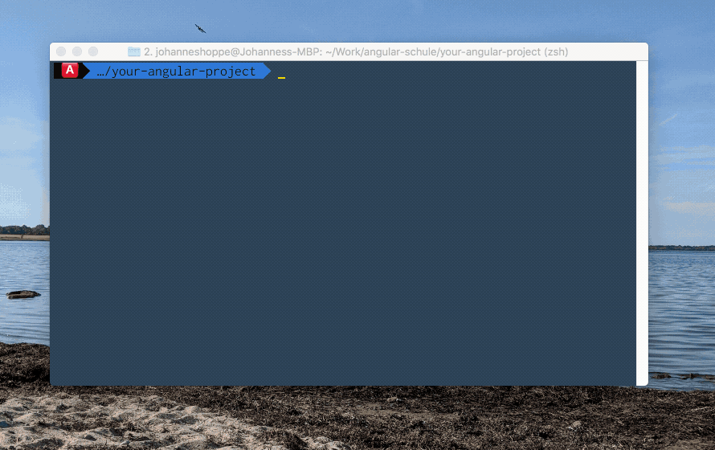

**With version 8.3 of the Angular CLI a new command has been released which has the potential to be a game changer. Now, deployments to any target (Firebase, Azure, Github pages...) are potentially only one CLI command away. In this article we discuss everything you need to know.** 

<hr>

- [Introduction](/blog/2019-08-ng-deploy#introduction)
- [Background](/blog/2019-08-ng-deploy#background)
- [Command Line Call](/blog/2019-08-ng-deploy#command-line-call)
- [Existing providers](/blog/2019-08-ng-deploy#existing-providers)
- [Caveats](/blog/2019-08-ng-deploy#caveats)
- [Summary](/blog/2019-08-ng-deploy#summary)


## Introduction

Angular team member Minko Gechev [recently added](https://github.com/angular/angular-cli/commit/5df50bacbe11f029e7d841395f16c02d804f07db) added a command to the CLI which invokes a so-called __deployment target builder__ for a project.
The amount of code added is relatively small, because builders have been around for a longer time and because the CLI itself does not have much to do, but passes the work on to other third-party code.
So it's up to the community to breathe life into the command.


## Background

In fact, the CLI already has this ability for a while.
Angular CLI allows us to extend the set of functionality by implementing builders and invoking them with `ng run [builder-name]`.
There is a very detailed [article about builders](https://angular.io/guide/cli-builder) provided in the official docs.


But until now deploy commands were not made on top of CLI builders.
Those commands are usually hidden in their own CLI (eg. `firebase deploy`) and have nothing to do with the Angular CLI.
Our own deploy command ([angular-cli-ghpages](https://github.com/angular-schule/angular-cli-ghpages/)) was one of them.
There was simply no requirement for us to implement a deeper integration into the CLI.

All right, until now builders have not yet achieved the necessary attention they deserve.
The new command `ng deploy` is designed to change that!
* it runs in the Angular CLI, so it's clear that an Angular App should be deployed and reasonable defaults can be set accordingly
* it is called `deploy` instead of `run` which might be confusing otherwise
* it throws a meaningfull message in case there is no deployment builder installed (`Cannot find "deploy" target for the specified project. You should add a package that implements deployment capabilities for your favorite platform.`)
* it has a very short syntax, because by default it will deploy the default project
* **and the most important point:**
  It is an invitation to the community to standardise deployments under the umbrella of the Angular CLI 


## Command Line Call

Let's take a look at the semantics. How is a deploy builder called?

Without any further arguments, the CLI will try to execute the deploy builder for the default project:

```bash
ng d [options]
```

Which is the same as:

```bash
ng deploy [options]
```

As you might know, you can manage several Angular Apps (projects) in one workspace.
The CLI accepts an optional project name, as specified in the `angular.json` configuration file.

```bash
ng run [PROJECT_NAME]:deploy [options]
```

The options are optional.
They will be passed to the deploy target for the selected project. 
So if you have created a project by calling `ng new your-angular-project`, the complete command could be:

```bash
ng run your-angular-project:deploy 
```


## Existing providers

There is already a good adaptation for `ng deploy`.
This is because Minko has [provided a sample project](https://github.com/mgechev/ngx-gh) and helped to implement some deploy targets.
The following providers are currently available:

* `@angular/fire` (deploys to Firebase)
* `@azure/ng-deploy` (deploys to Azure Static Hosting)
* `@netlify-builder/deploy` (deploys to Netlify)
* `@zeit/ng-deploy` (deploys to Now)
* `angular-cli-ghpages` (deploys to GitHub pages)

In future you should be able to find more providers via the following search:  
https://www.npmjs.com/search?q=ng%20deploy

You can try them out by executing the following commands.

1. Install the latest version of the Angular CLI.

   ```sh
   npm install -g @angular/cli
   ```

2. Run `ng version`, to make sure you have installed Angular CLI v8.3.0 or greater.

3. Update your existing project using the command:

   ```sh
   ng update @angular/cli @angular/core
   ```

4. Add one of the listed providers to your project.

   ```sh
   ng add [provider]
   ```

5. Deploy your project via:

   ```sh
   ng deploy
   ```

One example:



## Caveats

Right now `ng deploy` only support a single deploy target for a project.
If we want to deploy a project to more than one provider, it is necessary to rewrite the `angular.json` file.


<!-- question to Minko! -->

At least for me, is not yet clear whether a deploy builder should compile the project itself or not.
In the example project from Minko the deploy builder not only executed the deployment but also always compiled the project in production mode.
Of course this is very convenient, but on the other hand you might want to build another configuration.

We have opted for `angular-cli-ghpages` as following:  
By default, it builds in production mode, but you can configure it yourself using the option `--configuration'.

The project `@azure/ng-deploy` has found another solution.
Here you have to build by yourself with `ng build` and the builder deploys only the existing project from the `dist`-folder.

We will see which way will be broaldy adopted or whether there will be a recommendation from the Angular team. 

## Summary

With the new deployments, it will be even easier to manage an Angular application over the entire lifecycle.
In addition to code generation, build, testing and much more, we can now also conveniently deploy to any target like Azure, Firebase or Netfly.
More providers should come soon. 🚀

<hr>

_Picture: STS-126 Space Shuttle Endeavour Launch. This NASA still image is in the public domain._
<!-- https://publicdomainclip-art.blogspot.com/2008/11/sts-126-space-shuttle-endeavour-launch.html -->