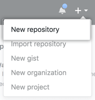
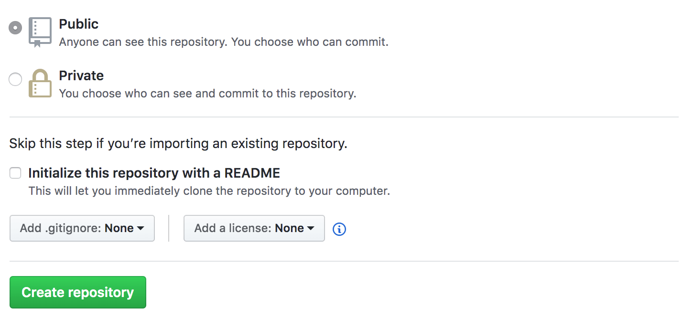
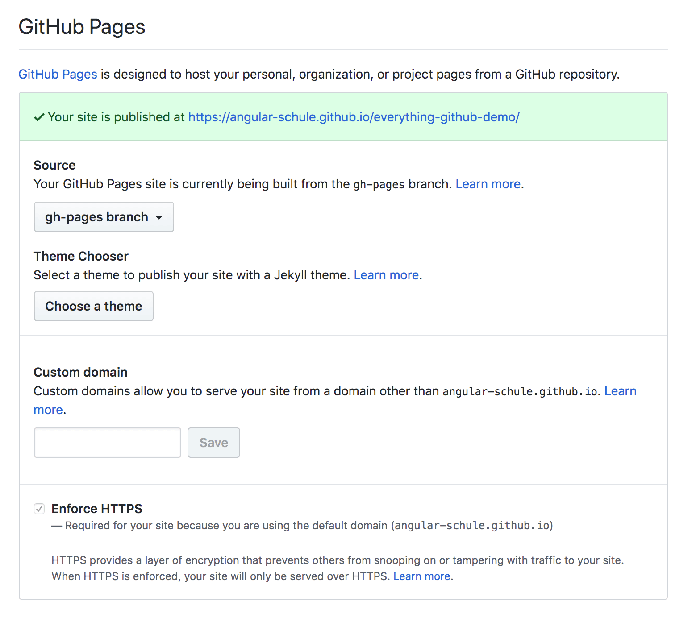
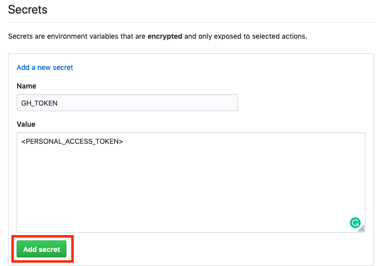
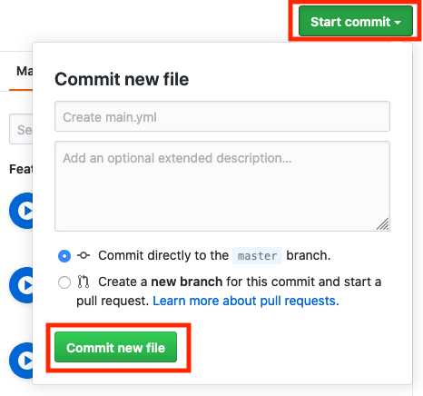

**In this article we want to use several tools from the Github universe to launch a website with Angular.
We will establish a professional pipeline, including version management, continuous deployment and web hosting.
Best of all, for public repositories, this won't cost you a single cent!**

<hr>

Table of contents:

- [Introduction](#introduction)
- [1. All parts explained](#1-all-parts-explained)
  - [1.1. Git and Github Version Control](#11-git-and-github-version-control)
  - [1.2. Github Actions](#12-github-actions)
  - [1.3. Github Pages](#13-github-pages)
  - [1.4. angular-cli-ghpages](#14-angular-cli-ghpages)
- [2. A simple Angular app](#2-a-simple-angular-app)
- [3. Hosting the source code on Github](#3-hosting-the-source-code-on-github)
- [4. A first deployment to GitHub Pages](#4-a-first-deployment-to-github-pages)
- [5. Automating the Deployment with GitHub Actions](#5-automating-the-deployment-with-github-actions)
  - [5.1 Setup a token](#51-setup-a-token)
  - [5.2 Setup the Github Action Flow](#52-setup-the-github-action-flow)
- [6. Extra: Custom Domain](#6-extra-custom-domain)
- [Summary](#summary)
- [Thank you by Dharmen](#thank-you-by-dharmen)
- [Thank you by Dharmen](#thank-you-by-dharmen-1)

## Introduction

All starts are hard, so we will try to explain all steps in detail, so that you can eventually come up with a fully deployed Angular app.
During our journey we will get comfortable with `angular-cli-ghpages` and Github Actions, and see how they work togehter.
We will create & setup tokens and Github Action YAML files, to deploy our Angular app directly to Github Pages, a free webhosting service from Github.

## 1. All parts explained

### 1.1. Git and Github Version Control

Version Control allows you to keep track of your work and helps you to easily recognize the changes you have made, whether it is program code, text, images or other data.
It is also absolutely necessary if you want to work together efficiently in a team.
[Git](https://git-scm.com/) is a free software for distributed version management and is currently the most popular solution.
The leading platform around Git is Github, which belongs to Microsoft since the end of 2018.
Please register an account on github.com, if you haven't already done so.
**It is sufficient to use the free account!**

### 1.2. Github Actions

[Github Actions](https://github.com/features/actions) is a solution for CI/CD pipelines (continuous integration and continuous delivery).
With actions we can test, build and release our code and while staying in the Github ecosystem.
Github has just recently launched this product to the market and is now directly competing with Travis CI, CircleCI or AppVeyor.
In contrast to former CI/CD monsters it is common with all mentioned providers to express the individual steps in the form of a YAML file and to store this file as part of the source code in the repository.
    
### 1.3. Github Pages

You can use [GitHub Pages](https://pages.github.com/) to host a website directly from a GitHub repository.
This website can either contain completely static content (i.e. pure HTML files and assets, but no scripts running on the server) oder or you can use Jekyll to convert Markdown files to static content.
We have no need for Jekyll to enrich an Angular app.
static content is all we need.

### 1.4. angular-cli-ghpages

[angular-cli-ghpages](https://github.com/angular-schule/angular-cli-ghpages) is a project made by Johannes Hoppe, one of the two authors of this article.
His Angular Book uses a new Github repository in every chapter (so there are quite a lot of repos 😅).
So he developed a solution that makes it as easy as possible to bring an Angular App to Github Pages.
The project exists since 2016 and if it was started today, it would certainly have a nicer name.
According to Github, 6800 projects already deploing with angular-cli-ghpages.


## 2. A simple Angular app

We assume that the majority of our readers have already worked with Angular. But in order for this article to be as complete as possible, we will very shortly set up a simple website based on Angular.

1. If you have not already done so, please install [Node.js](https://nodejs.org), [Google Chrome](https://www.google.com/chrome/) and optionally [Visual Studio Code](https://code.visualstudio.co) with the [Angular-Schule: Extension Pack](https://marketplace.visualstudio.com/items?itemName=angular-schule.angular-schule-extension-pack). Later on we also need [Git](https://git-scm.com/) for the deployment.

2. Install the latest version of the Angular CLI  globally and create a new Angular project.

    ```sh
    npm install -g @angular/cli
    ng new everything-github-demo --defaults
    ```

3. Now we want to make some small changes to the source code.
    With the command `code .` we open the current directory in the editor.

    ```sh
    cd everything-github-demo
    code .
    ```

4. We are changing the content of the `AppModule` and `AppComponent` a bit to prove that the Google search engine can correctly crawl our website – even with remotely loaded data.

    ```ts
    // src/app/app.module.ts (excerpt)
  
    import { HttpClientModule } from '@angular/common/http';
  
    @NgModule({
      declarations: [
        AppComponent
      ],
      imports: [
        BrowserModule,
        HttpClientModule // NEW: import HttpClientModule!
      ],
      bootstrap: [AppComponent]
    })
    export class AppModule { }
    ```
  
    For example, we could load a book from our backend at https://api.angular.schule.
  
    ```ts
    // src/app/app.component.ts
  
    import { Component } from '@angular/core';
    import { HttpClient } from '@angular/common/http';
  
    @Component({
      selector: 'app-root',
      templateUrl: './app.component.html',
      styleUrls: ['./app.component.css']
    })
    export class AppComponent {
      book: any = { };
  
      constructor(http: HttpClient) {
        http.get('https://api.angular.schule/book/9783864906466')
          .subscribe(b => this.book = b);
      }
    }
    ```
  
    ```html
    <!-- src/app/app.component.html -->
  
    <h1>Everything Github Demo</h1>
    <h4>deployed with ❤️ and angular-cli-ghpages</h4>
  
    <p>
    This is some dynamicaly loaded content that we hope to find in the Google index later on:
    </p>
  
    <hr>
  
    <h2>{{ book.title }}</h2>
    <p>
      
      {{ book.description }}
    </p>
    ```

    This example loads data from a remote API. Our hope is that later we will be able to findboth the regular text and as well the loaded book in the index of our preferred searchengine. We have also added Bootstrap to make the result look like this:

    


## 3. Hosting the source code on Github

Now we take care of version management.
This is very easy because the Angular CLI has already created a local Git repository for us. 

1. First things first. Let's save the latest changes.
   
  ```sh
  git add .
  git commit -m "chore: demo content"
  ```

2. In the upper-right corner of any GitHub page, use the ➕ drop-down menu, and select **New repository**.

    

3. Choose a short, memorable name for your repository.
    In our example, we will call it `everything-github-demo`.

4. For now, choose to make the repository **public**.
    Please note, the source code of public repositories is visible to the public.
    Since we want to use the free GitHub plan, we have to keep it public or we would lose access to the free hosting service of GitHub Pages.
  
    > There's one naughty little trick to work around that limitation, but we'll talk about that later on.

5. Since we already have source code, you should **not** initialize the repository with a a README.

    

6. After you have pressed "Create Repository" a confirmation page will appear.
    You can now connect to GitHub using SSH or HTTPS.
    Both ways will work, but GitHub recommends [HTTPS](https://help.github.com/en/github/using-git/which-remote-url-should-i-use).
    If you are completely lost in authenticating against GitHub, try cloning another repository with [Github Desktop](https://desktop.github.com/) first.
    For the remaining article we assume that the communication has been successful established.

    To add a new remote for GitHub, use the `git remote add` command:

    ```sh
    git remote add origin https://github.com/<username>/<repositoryname>.git
    ```
  
    Replace `<username>` (or organisation name) and `<repositoryname>` with your username from GitHub and the name of your new repository.
    <small>(In our example, it's `git remote add origin https://github.com/angular-schule/everything-github-demo.git`)</small>

7. Finally we can transfer the whole repository to GitHub:

  ```sh
  git push -u origin master
  ```
   
## 4. A first deployment to GitHub Pages

We are now ready to host our first app on Pages.
For this, the project must be compiled first and the compiled asseds should be pushed to a new branch.
That functionality is provided by `angular-cli-ghpages`.
GitHub will activate the hosting automatically, if this branch has the name `gh-pages` – which is the default setting for `angular-cli-ghpages`.

1. The following command adds `angular-cli-ghpages` to your project.

    ```sh
    ng add angular-cli-ghpages
    ```

2. Now we can deploy our project to GitHub pages with all default settings.
   The project will be automatically built in production mode:

   ```sh
   ng deploy
   ```

3. The app should be available at `https://<username>.github.io/<repositoryname>/` soon.
   If it is not immediately available, you should first wait a moment.

4. If we now check the results (in our case at https://angular-schule.github.io/everything-github-demo/) we will see a blank page! 😲
    But no problem, we open the Console panel of the Chrome DevTools by pressing `Control+Shift+I` (Windows, Linux) or `Command+Option+I` (Mac).
    We immediately see some red 404 errors for all files:

    > Failed to load resource: the server responded with a status of 404 ()

    Well, the reason for that is simple:
    The application is configured as if it is running on the root path of the domain.
    But this is not the case here!
    Our application is located in the `/<repositoryname>/` path, so all links are broken.
    This is of course adjustable.
    Therefore, we will try the deployment a second time:

   ```sh
   ng deploy --base-href=/<repositoryname>/

   # so in our case it must be
   ng deploy --base-href=/everything-github-demo/
   ```

5. And now you should see our app running on Github Pages!
    You can make sure that everything went well when you go into the **Settings** of the repo.
    Scroll down there to the GitHub Pages section.
    The following should appear here:

    

    **Hint:** You can also see the setting for a custom domain here.
    Please do not try to set a value.
    This will work for the first time, but the setting is not permanent, because `angular-cli-ghpages` will overwrite it again.


## 5. Automating the Deployment with GitHub Actions

But we don't want to stop here and trigger the deployment manually all the time.
We want to make changes to the app and the deployment should be handled automatically for us.
For this we want to use GitHub Actions.
GitHub Actions is now available for all reopsitories.
So there is no need to register anymore, we can start right now! 🚀

As with all CI systems, you first have to master a few difficulties.
Until now, it was easy to deploy manually because we had both rights to the repository and authentication was already done.
But if a machine is supposed to take over the tasks for us, then we have to grant these possibilities in the first place.
The easiest way to realize this is with tokens.

> **Warning:** Treat tokens like passwords and keep them secret. Always use tokens as environment variables instead of hardcoding them into your code!

### 5.1 Setup a token

We should create a **personal access token** and use it in place of a password when performing Git operations. In theory you can also work with username and password, but we will never show you how to do that. 😉

Please do not be mistaken, there is also an environment variable called `GITHUB_TOKEN`.
This one does not work for our purposes ([see issue #73](https://github.com/angular-schule/angular-cli-ghpages/issues/73#issuecomment-527405699)).


1. Create a [Personal Access Token **with repo access**](https://help.github.com/en/articles/creating-a-personal-access-token-for-the-command-line) and make sure to copy your new token to the clipboard.
   You won’t be able to see it again! 
If you want to remember the token later on, save it in a secure place only (i.e. a password manager).
    Please make sure that it has this access:
   

2. Open up your Angular app's Github repo.

3. Go to **Settings** > **Secrets** and click on **Add a new secret**.

    

    Secrets are encrypted environment variables and only exposed to selected Github Actions.
    GitHub automatically redacts secrets printed to the log, but you should avoid printing secrets to the log intentionally.

4. Create a secret with name `GH_TOKEN` and paste your token (which you copied in step 1) in value.
    Finish this chapter by clicking the green **Add secret** button. 

    

    It is perfectly fine not to store the token anywhere else.
    You can always create new tokens and just throw the old ones away.

> **Extra tip:** For our organisation Angular.Schule we have created an extra account which is only dedicated for deploying applications. We only give that account access to the repositories where there is something to deploy. This increases security again, because unfortunately you cannot limit personal access tokens to specific repositories. 

### 5.2 Setup the Github Action Flow

Now we have everything ready.
We can create an automated workflow that will do the work for us in the future.

1. Again in our repo, we go to **Actions** and click on **Set up workflow yourself**.

    

2. A editor will open, keep the file name (e.g. `main.yml`) as it is, simply replace the entire content with the following example:

    ```yml
    name: Deploy to GitHub Pages via angular-cli-ghpages
    
    on: [push]
    
    jobs:
      build-and-deploy:
        runs-on: ubuntu-latest
    
        steps:
        - name: Checkout
          uses: actions/checkout@v1
    
        - name: Use Node.js 10.x
          uses: actions/setup-node@v1
          with:
            node-version: 10.x
    
        - name: Prepare and deploy
          env:
            CI: true
            GH_TOKEN: ${{ secrets.GH_TOKEN }}
          run: |
            npm install
            npm run lint
            ###
            # You can un-comment below 2 test scripts, if you have made     respective changes mentioned at https://angular.io/guide/    testing#configure-cli-for-ci-testing-in-chrome
            ####
            # npm test -- --no-watch --no-progress --browsers=ChromeHeadlessCI
            # npm run e2e -- --protractor-config=e2e/protractor-ci.conf.js
            ####
            npm run ng -- deploy --base-href=/everything-github-demo/
    ```

3. If you want Github Actions CI/CD to perform tests, you will need to [make some configurations](https://angular.io/guide/testing#configure-cli-for-ci-testing-in-chrome) in your Angular app.
    After those changes have been done, you can un-comment the `npm test ...` and `npm run e2e ...` commands in above example.

4. We can also control when our workflows are triggered:
    It can be helpful to not have our workflow run on every push to every branch in the repo.
     - For example, this workflow only runs on push events to `master` and `release` branches:

        ```yml
        on:
          push:
            branches:
            - master
            - release/*  # branches matching refs/heads/release/*
        ```
      
        Here we see the very common convention of grouping branches with a slash (e.g. `relase/42`).
        Many git clients will display those groups like folders.

     - As another example, we can run the scrupt every day of the week from Monday - Friday at 02:00:

        ```yml
        on:
          schedule:
            - cron: 0 2 * * 1-5
        ```

   - For more information see [Events that trigger workflows](https://help.github.com/articles/events-that-trigger-workflows) and [Workflow syntax for GitHub Actions](https://help.github.com/articles/workflow-syntax-for-github-actions#on).

5. Then, click on **Start commit**, add message and description if you like and click on **Commit new file**.

    

6. **Done!** 🚀.  
   The action will run by itself the first time.

Next time when you push your changes to Github, Github Actions will run the workflow we created and it will deploy your updated app on Github Pages.


## 6. Extra: Custom Domain

TODO


## Summary

I hope that now you know how to setup `angular-cli-ghpages` with Github Actions.
Please checkout [angular-cli-ghpages options](https://github.com/angular-schule/angular-cli-ghpages/#options) for more options to deploy, like: `--repo <URL>` to deploy your app to different repo's Github Pages.
And it's not just CI/CD setup, there are lot many things we can do in [Github Actions](https://github.com/features/actions). Also checkout [Github Marketplace for Actions](https://github.com/marketplace?type=actions) to see more workflows.

## Thank you by Dharmen

Special thanks go to [Johannes Hoppe](https://twitter.com/johanneshoppe) for giving me an opportunity to write this article.

## Thank you by Dharmen

Thanks to Dharmen for contributing to `angular-cli-ghpages` and for starting this article.

<!--
<small>**Header image:** Photo by [SpaceX](https://unsplash.com/@spacex?utm_source=unsplash&utm_medium=referral&utm_content=creditCopyText) on [Unsplash](https://unsplash.com/s/photos/launch?utm_source=unsplash&utm_medium=referral&utm_content=creditCopyText)</small>
-->

....
